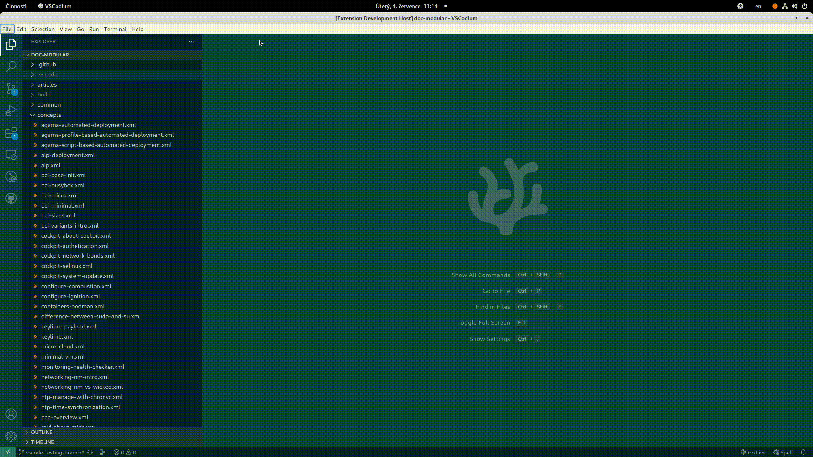

= vscode-daps README

== Features

The DAPS tool helps you author and publish documentation written in DocBook XML.
This extension makes it easier to run selected DAPS commands from the VSCode
editor.

== Requirements

This extension requires that you...

* install DAPS on your system. Refer to https://opensuse.github.io/daps/ for
  more details.

== Known Issues

See our issue tracker at
https://github.com/openSUSE/vscode-daps/issues[openSUSE/vscode-daps/issues].

= Usage

The following sections illustrate how to use the `vscode-daps` extension to run
DAPS commands.

== Formatting an XML document

To format the currently opened active XML document, right-click its tab and
select `DAPS` > `Format XML Document`.

image::./media/format-xml-editor-tab.gif[width=800]

TIP: Use the predefined `CTRL` + `SHIFT` + `I` shortcut to do the same job.

To format *any* XML document from the Explorer view, right-click its name in
Explorer and select `DAPS` > `Format XML Document`.

image::./media/format-xml-explorer-context.gif[width=800]

== Validating an XML document

You can validate a document specified by its DC file. Right-click the DC file in
the Explorer view and select `DAPS` > `Validate`.

image::./media/daps-validate-explorer-context.gif[width=800]

Or, you can specify the DC file manually from a drop-down list. Verify that the
Explorer shows a documentation project, then press `CTRL` + `SHIFT` + `P` to open
the command palette. Start to type `daps` and select `Validate`. Then select
the desired DC file from the populated drop-down list.

image::./media/daps-validate-palette.gif[width=800]

== Building PDF and HTML versions with a DC file

To build a document specified by its DC file, right-click the DC file in the
Explorer view and select `DAPS` > `Build with DC file`. When asked, choose
whether to build `pdf` or `html`.

image::./media/build-html-explorer-context.gif[width=800]

If you prefer typing to mouse movements, you can run the build command from the
Command Palette. Press `CTRL` + `SHIFT` + `P`, start typing `daps` and when
available, select the `DAPS: Build with DC file` command. Select the DC file
from the populated list and, finally, choose whether to build `pdf` or `html`.

TIP: After the build is finished, you can directly open the resulting document
or copy its path to a clipboard.

== Building PDF and HTML versions by root ID

Besides building a whole book, you can build only a part of it, for example, a
chapter or a topic. To achieve this, you need to specify a top-level element
root ID. Press `CTRL` + `SHIFT` + `P`, start typing `daps` and when available,
select the `DAPS: Build with root ID`. Choose the DC file from the populated
list, then the root ID to build. Finally, choose whether to build `pdf` or
`html`.

image::./media/build-root-id-palette.gif[width=800]

IMPORTANT: Populating the list of root IDs can take a few seconds.

Alternatively, you can select the root ID with the mouse in your active editor
and right-click the selection. Then select `DAPS` > `Build with root ID`. Select
the DC file from the populated list and, finally, choose whether to build `pdf`
or `html`.

image::./media/build-root-id-selection.gif[width=800]

== Building PDF and HTML versions of an XML file

To build the currently active XML document, right-click its editor tab and
select `DAPS` > `Build XML file`. Finally, choose whether to build `pdf` or
`html`.

To build *any* XML file, right-click its name in the explorer view and select
`DAPS` > `Build XML file`. Finally, choose whether to build `pdf` or `html`.

== Document preview

To preview a DocBook XML file, right-click its editor tab and select `DAPS` >
`Preview Document`. A new tab opens to the right of the active source editor and it
gets updated on each source editor change.

== Document structure

You can view a document structure tree view inside the Explorer
pane. Navigate to a related section by clicking its title in the
structure.

image::./media/doc-structure-treeview.png[width=480]

== XML entity autocompletion

Start typing `&` and VSCode tries to find the right entity as you type. You can specify
which entity files to exclude. By default, all referenced entity files are included.

== CodeLens support

With the DocBook assembly XML (`*.asm.xml`) open, you can navigate to referenced
files directly from the assembly `<strucure/>`.

image::./media/codelens-asm.png[width=800]

== Making it quicker with options

If you work on a project and use the same DC file, target format, or root ID
over and over, you can specify this information in the `.vscode/settings.json`
file of your project. After you save the modified `.vscode/settings.json` file,
you will not be asked by VSCode to specify the included options when running the
commands described below.

