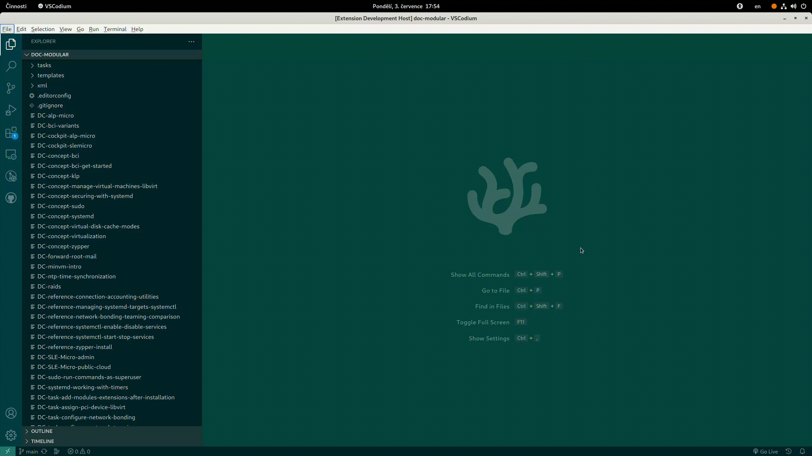
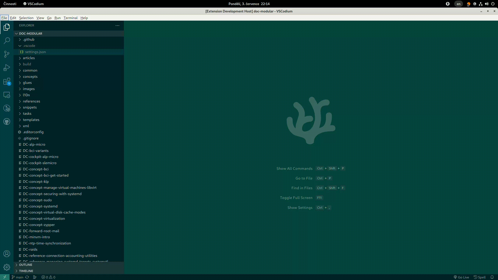

# daps-vscode README

## Features

The DAPS tool helps you author and publish documentation written in DocBook XML.
This extension makes it easier to run selected DAPS commands from the VSCode
editor.

## Requirements

This extension requires that you install DAPS on your system. Refer to
(https://opensuse.github.io/daps/) for more details.

## Usage

The following sections illustrate how to use the `vscode-daps` extension to run
DAPS commands.

### Validate XML documents

You can validate a document specified by its DC file. Right click the DC file in
the Explorer view and select `Daps` -> `Validate`.

Or, you can specify the DC file manually from a drop down list. Verify that the
Explorer shows a documentation project, then press `CTRL`+`SHIFT`+`P` to open a
command palette. Start to type `DAPS` and select  `Validate`. Then select the
desired DC file from the populated drop down lists.

## Known Issues

See our issue tracker at
[openSUSE/vscode-daps/issues](https://github.com/openSUSE/vscode-daps/issues)
