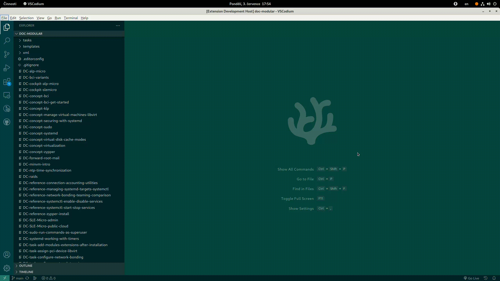

[#vscode-daps-commons]
= Common commands

The following sections describe commands that you can perform on both DocBook and AsciiDoc documents.

[#vscode-daps-commons-validate]
== Validating a document

To validate a document, right-click the DC file in the Explorer view and select menu:DAPS[Validate].

Alternatively, you can specify the DC file manually from a drop-down list:

. Verify that the Explorer shows a documentation project.
. Press kbd:[Ctrl+Shift+P] to open the command palette.
. Start typing `daps` and select `DAPS: Validate`.
. From the populated drop-down list, select the DC file to validate.

image::../media/daps-validate-palette.gif[width=800]

[#vscode-daps-commons-builddc]
== Building a document with a DC file

To build a document specified by its DC file, right-click the DC file in the Explorer view and select menu:DAPS[Build with DC file].
When asked, choose whether to build `pdf` or `html`.

image::../media/build-html-explorer-context.gif[width=800]

If you prefer typing to mouse movements, you can run the build command from the Command Palette:

. Press kbd:[Ctrl+Shift+P] and start typing `daps`.
. When available, select the `DAPS: Build with DC file` command.
. Select the DC file from the populated list and choose whether to build `pdf` or `html`.

TIP: After the build is finished, you can directly open the resulting document
or copy its path to a clipboard.

[#vscode-daps-commons-buildroot]
== Building a document by its root ID

Besides building a whole book, you can build only a part of it, for example, a chapter or a topic.
To achieve this, you need to specify a top-level element ID:

. Press kbd:[Ctrl+Shift+P] and start typing `daps`.
. Select the `DAPS: Build with root ID` command.
. Select the DC file from the populated list, then the root ID to build.
. Finally, choose whether to build `pdf` or `html`.

image::../media/build-root-id-palette.gif[width=800]

IMPORTANT: Populating the list of root IDs can take a few seconds.

Alternatively, you can select and build the root ID from the active editor:

. Select the root ID by the mouse and right-click the selection.
. Select menu:DAPS[Build with root ID].
. Select the DC file from the populated list and choose whether to build `pdf` or `html`.

image::../media/build-root-id-selection.gif[width=800]