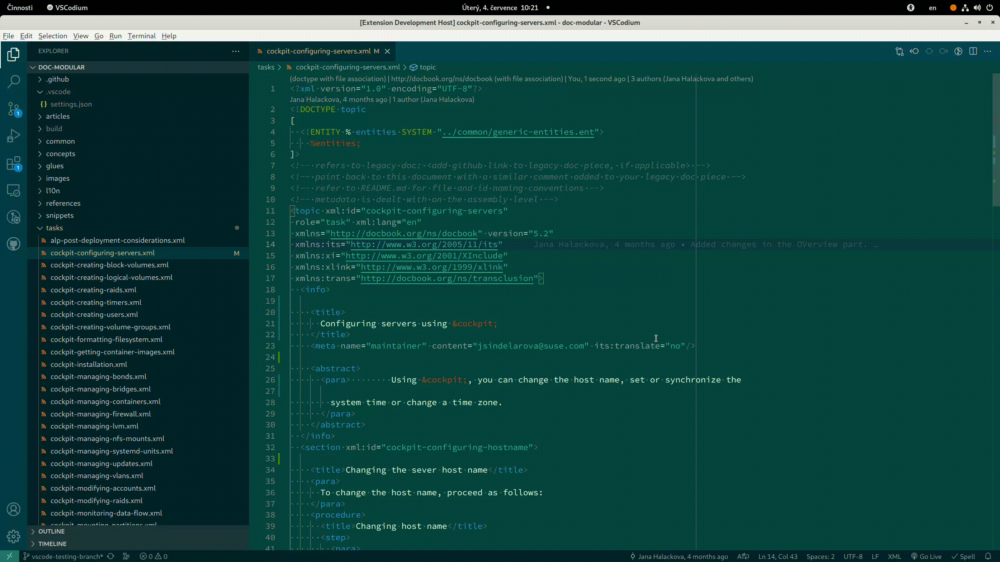
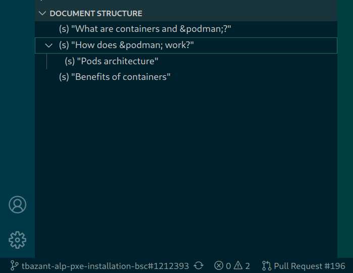
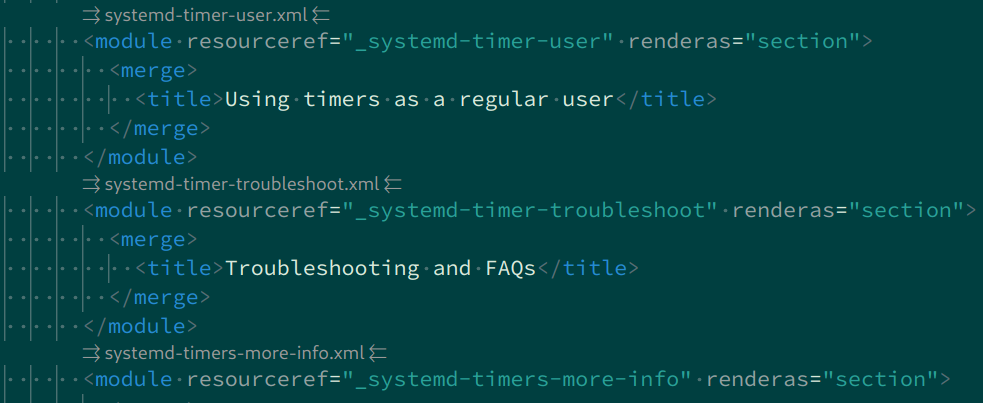

[#vscode-daps-docbooks]
= DocBook-specific commands

The following sections describe commands that you can perform on DocBook documents.

== Formatting a document

To format the document in the active editor, right-click its tab and select menu:DAPS[Format XML Document].

[TIP]
====
Use the predefined kbd:[Ctrl+Shift+I]] shortcut to format a document.
====

[TIP]
====
To format *any* (even closed) document, right-click its name in Explorer and select menu:DAPS[Format XML Document].

image::../media/format-xml-explorer-context.gif[width=800]
====

== Building a single file

To build the document in the active editor, right-click its tab and select menu:DAPS[Build XML file].
Finally, choose whether to build `pdf` or `html`.

To build *any* (even closed) file, right-click its name in the Explorer and select menu:DAPS[Build XML file].
Finally, choose whether to build `pdf` or `html`.

== Previewing a document

To preview the document in the active editor, right-click its editor tab and select menu:DAPS[Preview Document].
A new tab opens to the right of the active editor with the preview.
It is updated on each source editor change.

== Viewing a document structure

You can view a document structure in the Explorer pane.

[TIP]
====
Navigate to a displayed section by clicking its title in the structure tree.
====

== Autocompleting XML entities

Start typing `&` and the editor tries to find the right entity as you type.

== CodeLens support

With the DocBook assembly XML file active, you can navigate to referenced files directly from the assembly `<strucure/>` code.

